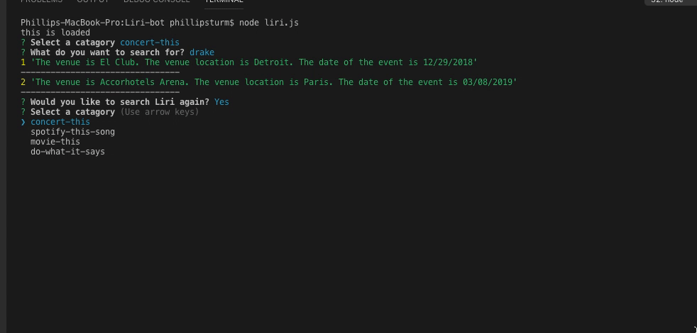

**ABOUT**

LIRI is like iPhone's SIRI. However, while SIRI is a Speech Interpretation and Recognition Interface, LIRI is a Language Interpretation and Recognition Interface. LIRI will be a command line node app that takes in parameters and gives you back data.

**NPM's USED**

* fs:           For accessing other files.
* moment:       For formatting time for tour dates.
* axios:        For making API calls.
* spotify:      For accessing the Spotify API.
* inquirer:     For writing questions and getting user inputs in the console.

**API's USED**

* Bandsintown
* Spotify
* OMDB

**FUNCTIONALITY**

When you run this file in your terminal (node liri.js), a list immediately displays a prompt for which data you would like to recieve via the _inquirer_ npm. You can choose between:

1. concert-this: Searching Bandsintown 
2. spotify-this-song: Searching Spotify
3. movie-this: Searching Omdb
4. do-what-it-says: Reading a text file that is connected 

**CONCERT-THIS**

Want to see tour informtaion about your favorite band? Select the concert-this option, and a follow up question pulls up asking what you would like to search for. Input your band's name and hit enter. The following data is gathered from the _BandsInTown API_ and appears in your console for their upcoming shows.

1. Name of the venue
2. Location of the venue
3. Date of the event (formatted into MM,DD,YYYY with _Moment_)

**SPOTIFY-THIS-SONG**

If concerts aren't your thing and you want to learn more about a song, select the spotify-this-song option. A follow up question pulls up asking what you would like to search for. Input the song you're interested in and hit enter. The following data from your input appears in your console from the _Spotify API_. If no song is provided then your program will default to _"The Sign"_ by Ace of Base.

1. Artist(s)
2. Name of the song
3. External link to the song
4. Album that the song is from

**MOVIE-THIS**

Now that you know the song information and tour dates for that new group, select the movie-this option. Enter the movie you want to learn about and appear smart to your friends when you talk about the movie with them. The _OMDB API_ is accessed the following data displays in your console. If the user doesn't type a movie in, the program will output data for the movie _"Mr. Nobody."_

1. Movie title
2. Release year
3. IMDB rating 
4. Rotten Tomatoes Rating
5. Country where the movie was produced
6. Language 
7. Plot synopsis
8. Cast

**DO-WHAT-IT-SAYS-**

The final option is do-what-it-says. If you select this, information from the random.txt is read by using the _fs npm_. The song information for _"I want it that way"_ is supposed to appear in the console. However I misread the instructions and didn't realize that until 5 minutes ago and this is due now, so I'll have to add that later. 

**RESET SEARCH**

If you noticed the last line of the GIF's above, there is an _inquirer_ confirm prompt asking if you would like to do another search with the Liri. If you select yes, the liri function is restarted and the initial prompt is displayed. If you select no, Liri politely says "Adios Amigo".

